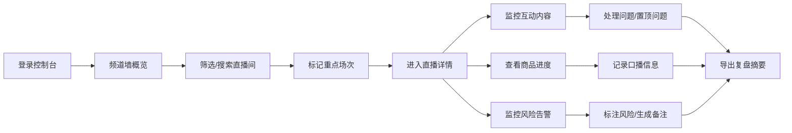
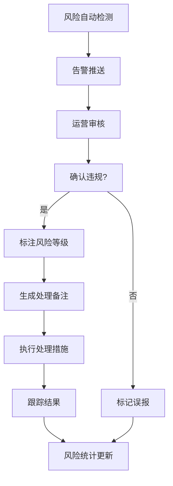

# 直播运营控制台 PRD

## 1. 产品概述

直播平台内容运营大屏监控控制台，面向内容运营团队，用于实时监看多场直播、管理互动内容、把控商品节奏、识别风险内容、分析数据趋势、协调场控排班的一站式运营工作台。

- 目标用户：内容运营专员、场控主管、运营经理
- 核心价值：提升多场直播同时监控效率，降低违规风险，优化直播转化效果

## 2. 核心功能

### 2.1 用户角色

| 角色 | 登录方式 | 核心权限 |
|------|----------|----------|
| 内容运营 | 账号登录 | 查看频道墙、管理互动、标记风险、导出复盘 |
| 场控主管 | 账号登录 | 全部运营权限 + 排班管理 + 数据查看 |
| 运营经理 | 账号登录 | 全部权限 + 数据对比分析 |

### 2.2 功能模块

1. **频道墙**：多路直播画面墙、开播筛选、重点标记、状态监控
2. **直播详情**：主播信息、在线人数趋势、直播间基础数据
3. **互动管理**：观众问题置顶、高频评论整理、弹幕审核
4. **商品管理**：商品讲解进度、优惠口播记录、商品转化数据
5. **风险监控**：违规风险标注、处理备注生成、风险等级评估
6. **数据分析**：观看峰值对比、转化趋势分析、多场数据对标
7. **排班管理**：场控排班查看、班次交接、值班人员信息

### 2.3 页面详情

| 页面名称 | 模块名称 | 功能描述 |
|----------|----------|----------|
| 频道墙 | 直播画面网格 | 2x3/3x3网格展示多路直播缩略画面，支持点击放大 |
| 频道墙 | 筛选工具栏 | 按开播状态、分类、主播等级筛选，搜索直播间 |
| 频道墙 | 重点标记 | 星标标记重点场次，优先展示，支持颜色分类 |
| 频道墙 | 状态指示器 | 在线人数、弹幕速度、开播时长、画质状态实时显示 |
| 直播详情 | 主播信息卡 | 头像、昵称、等级、粉丝数、历史场均数据 |
| 直播详情 | 实时数据面板 | 在线人数、峰值、新增关注、互动率等核心指标 |
| 直播详情 | 人气趋势图 | 在线人数随时间变化曲线图，支持缩放查看 |
| 互动管理 | 问题置顶区 | 展示已置顶的观众问题，支持取消置顶、排序 |
| 互动管理 | 高频评论 | 自动聚类相似评论，展示热度排名，支持屏蔽 |
| 互动管理 | 弹幕流 | 实时弹幕滚动展示，支持关键词高亮、快捷操作 |
| 商品管理 | 讲解进度条 | 当前讲解商品、已讲/待讲商品列表、进度可视化 |
| 商品管理 | 口播记录 | 优惠信息记录、口播时间戳、转化效果追踪 |
| 商品管理 | 商品列表 | 商品卡片展示，包含价格、库存、点击量、转化率 |
| 风险监控 | 风险告警列表 | 违规内容实时告警，按风险等级排序 |
| 风险监控 | 处理备注 | 记录处理措施、处理人、处理时间，支持追加备注 |
| 风险监控 | 风险统计 | 今日违规次数、类型分布、处理时效统计 |
| 数据分析 | 观看峰值对比 | 多场直播峰值人数柱状图对比 |
| 数据分析 | 转化趋势 | 关注转化、商品点击、成交转化趋势线 |
| 数据分析 | 数据导出 | 支持单场数据导出、多场对比报表导出 |
| 排班管理 | 排班日历 | 按日期展示场控排班，支持日/周视图切换 |
| 排班管理 | 班次信息 | 每班人员名单、职责分工、交接时间 |
| 排班管理 | 值班状态 | 当前值班人员、在线状态、联系方式 |

## 3. 核心流程

### 3.1 日常运营监控流程

运营人员登录控制台 → 进入频道墙查看全部开播频道 → 筛选重点关注场次 → 点击进入单场直播详情 → 监控互动/商品/风险 → 发现问题及时处理 → 导出复盘摘要

### 3.2 风险处理流程

系统自动识别风险 → 风险告警推送 → 运营人员审核 → 标注风险等级 → 生成处理备注 → 跟踪处理结果 → 记入风险统计

## 4. 用户界面设计

### 4.1 设计风格

- **主色调**：深空蓝 (#0F172A) 作为夜间模式主背景，搭配科技感青蓝色 (#06B6D4) 作为主强调色
- **辅助色**：成功绿 (#10B981)、警告橙 (#F59E0B)、危险红 (#EF4444)、信息紫 (#8B5CF6)
- **按钮风格**：圆角矩形按钮，悬浮时微微上浮，带微妙发光效果
- **字体**：标题使用极具科技感的字体，正文使用清晰易读的无衬线字体
- **布局风格**：卡片式布局，信息密度高，大屏优化，支持1920x1080及以上分辨率
- **视觉效果**：深色主题下的霓虹光效、数据可视化发光效果、微妙的网格背景

### 4.2 页面设计概览

| 页面名称 | 模块名称 | UI 元素 |
|----------|----------|---------|
| 频道墙 | 画面网格 | 卡片式直播画面，角标显示状态，悬浮放大动效 |
| 直播详情 | 数据面板 | 大号数字指标，渐变背景，趋势迷你图 |
| 互动管理 | 评论流 | 左右分栏，左侧置顶区，右侧滚动评论流 |
| 商品管理 | 进度条 | 时间轴式讲解进度，商品卡片带光泽效果 |
| 风险监控 | 告警列表 | 按严重程度颜色编码，脉动告警动画 |
| 数据分析 | 图表区 | 大面积图表，多色线条，悬浮数据提示 |
| 排班管理 | 日历视图 | 网格排班表，颜色区分班次，人员头像 |

### 4.3 响应式设计

- 桌面优先设计，针对大屏（1920x1080及以上）优化
- 支持1280px宽度以上的笔记本屏幕
- 侧边栏可折叠，主内容区自适应
- 表格和图表支持横向滚动

### 4.4 动效与交互

- 页面切换：淡入淡出 + 轻微位移
- 数据更新：数字滚动动画，图表平滑过渡
- 风险告警：呼吸灯效果，吸引注意力
- 按钮交互：悬浮上移 + 阴影加深 + 微妙发光
- 卡片交互：悬浮轻微放大 + 边框高亮
- 主题切换：平滑过渡动画，0.3秒渐变
