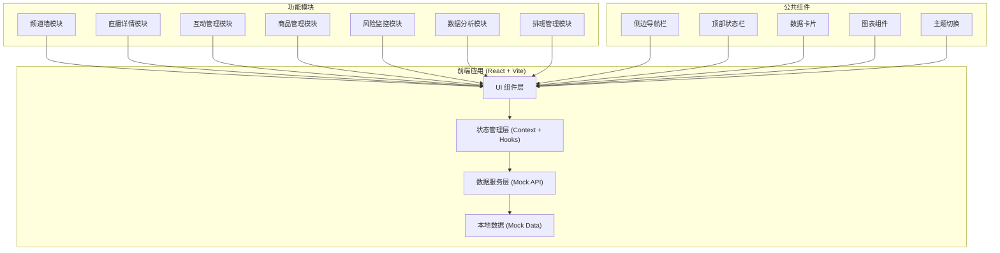

# 直播运营控制台 技术架构文档

## 1. 架构设计



## 2. 技术描述

- **前端框架**：React@18 + TypeScript
- **构建工具**：Vite@5
- **样式方案**：TailwindCSS@3 + CSS Variables
- **路由管理**：React Router@6
- **图表库**：Recharts（React 图表库，轻量且功能丰富）
- **图标库**：Lucide React（简洁现代的图标集）
- **状态管理**：React Context + Hooks（本地状态，无需复杂状态管理）
- **数据模拟**：本地 Mock 数据，模拟实时更新效果
- **日期处理**：date-fns（轻量级日期工具库）

## 3. 路由定义

| 路由 | 页面名称 | 说明 |
|------|----------|------|
| / | 频道墙 | 默认首页，展示多路直播画面 |
| /channels | 频道墙 | 频道列表与画面墙 |
| /live/:id | 直播详情 | 单场直播详细数据与监控 |
| /interaction/:id | 互动管理 | 观众互动、评论、弹幕管理 |
| /products/:id | 商品管理 | 商品讲解进度、口播记录 |
| /risks/:id | 风险监控 | 违规风险、处理备注 |
| /analytics | 数据分析 | 多场数据对比与趋势分析 |
| /schedule | 排班管理 | 场控排班与值班信息 |

> 注：带 `:id` 的路由接受直播间 ID 参数，用于查看单场直播详情。若无 ID 则显示默认选中的直播间。

## 4. 数据模型

### 4.1 直播间 (LiveRoom)

```typescript
interface LiveRoom {
  id: string;
  title: string;
  anchor: Anchor;
  category: string;
  status: 'live' | 'waiting' | 'ended';
  viewers: number;
  peakViewers: number;
  duration: number; // 秒
  isStarred: boolean;
  starColor?: string;
  coverUrl: string;
  quality: 'hd' | 'sd' | 'fhd';
  danmakuSpeed: number; // 条/分钟
  startTime: Date;
}
```

### 4.2 主播 (Anchor)

```typescript
interface Anchor {
  id: string;
  name: string;
  avatar: string;
  level: number;
  followers: number;
  avgViewers: number;
  category: string;
}
```

### 4.3 评论/弹幕 (Comment)

```typescript
interface Comment {
  id: string;
  userId: string;
  userName: string;
  userAvatar: string;
  content: string;
  timestamp: Date;
  isPinned: boolean;
  isHighlighted: boolean;
  type: 'normal' | 'question' | 'gift' | 'system';
  likeCount: number;
}
```

### 4.4 商品 (Product)

```typescript
interface Product {
  id: string;
  name: string;
  image: string;
  price: number;
  originalPrice: number;
  stock: number;
  soldCount: number;
  clickCount: number;
  status: 'pending' | 'explaining' | 'done';
  explainDuration: number; // 预计讲解时长（秒）
  explainStartTime?: Date;
  order: number;
}
```

### 4.5 风险告警 (RiskAlert)

```typescript
interface RiskAlert {
  id: string;
  roomId: string;
  type: 'violence' | 'porn' | 'politics' | 'fraud' | 'copyright' | 'other';
  level: 'low' | 'medium' | 'high' | 'critical';
  description: string;
  screenshotUrl?: string;
  timestamp: Date;
  status: 'pending' | 'processing' | 'resolved' | 'false_alarm';
  handler?: string;
  handleTime?: Date;
  notes: RiskNote[];
}

interface RiskNote {
  id: string;
  content: string;
  author: string;
  timestamp: Date;
}
```

### 4.6 口播记录 (OralBroadcast)

```typescript
interface OralBroadcast {
  id: string;
  roomId: string;
  productId?: string;
  content: string;
  timestamp: Date;
  type: 'discount' | 'coupon' | 'reminder' | 'other';
  effect?: {
    clickIncrease: number;
    orderIncrease: number;
  };
}
```

### 4.7 排班 (Schedule)

```typescript
interface Schedule {
  id: string;
  date: string; // YYYY-MM-DD
  shifts: Shift[];
}

interface Shift {
  id: string;
  name: string; // 早班/中班/晚班
  startTime: string; // HH:mm
  endTime: string; // HH:mm
  members: Staff[];
  responsibilities: string[];
}

interface Staff {
  id: string;
  name: string;
  avatar: string;
  role: 'moderator' | 'supervisor' | 'manager';
  phone: string;
  isOnline: boolean;
}
```

### 4.8 数据指标 (AnalyticsData)

```typescript
interface AnalyticsData {
  roomId: string;
  roomTitle: string;
  date: string;
  metrics: {
    peakViewers: number;
    avgViewers: number;
    totalViewers: number;
    newFollowers: number;
    interactionRate: number;
    productClicks: number;
    orders: number;
    gmv: number;
    conversionRate: number;
  };
  viewerTrend: TimePoint[];
  conversionTrend: TimePoint[];
}

interface TimePoint {
  time: string;
  value: number;
}
```

## 5. 目录结构

```
src/
├── components/          # 公共组件
│   ├── Layout/         # 布局组件（侧边栏、顶栏）
│   ├── common/         # 通用组件（卡片、按钮、模态框）
│   └── charts/         # 图表组件
├── pages/              # 页面组件
│   ├── ChannelWall/    # 频道墙
│   ├── LiveDetail/     # 直播详情
│   ├── Interaction/    # 互动管理
│   ├── Products/       # 商品管理
│   ├── Risks/          # 风险监控
│   ├── Analytics/      # 数据分析
│   └── Schedule/       # 排班管理
├── data/               # Mock 数据
│   ├── channels.ts
│   ├── comments.ts
│   ├── products.ts
│   ├── risks.ts
│   └── schedule.ts
├── hooks/              # 自定义 Hooks
│   ├── useTheme.ts     # 主题切换
│   ├── useLiveData.ts  # 直播数据模拟
│   └── useTimer.ts     # 计时器
├── context/            # Context
│   └── ThemeContext.tsx
├── types/              # TypeScript 类型定义
│   └── index.ts
├── utils/              # 工具函数
│   ├── format.ts       # 格式化工具
│   └── export.ts       # 导出功能
├── App.tsx
├── main.tsx
└── index.css
```

## 6. 主题系统

使用 CSS Variables + React Context 实现白天/夜间主题切换：

```css
:root {
  --bg-primary: #ffffff;
  --bg-secondary: #f8fafc;
  --text-primary: #0f172a;
  --text-secondary: #64748b;
  --border-color: #e2e8f0;
  --accent-color: #06b6d4;
  /* ... 更多变量 */
}

[data-theme="dark"] {
  --bg-primary: #0f172a;
  --bg-secondary: #1e293b;
  --text-primary: #f1f5f9;
  --text-secondary: #94a3b8;
  --border-color: #334155;
  --accent-color: #06b6d4;
  /* ... 更多变量 */
}
```
